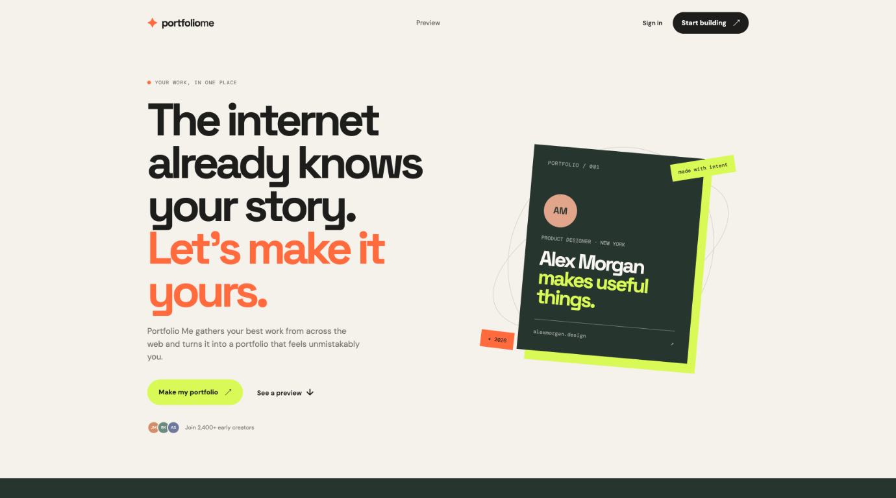
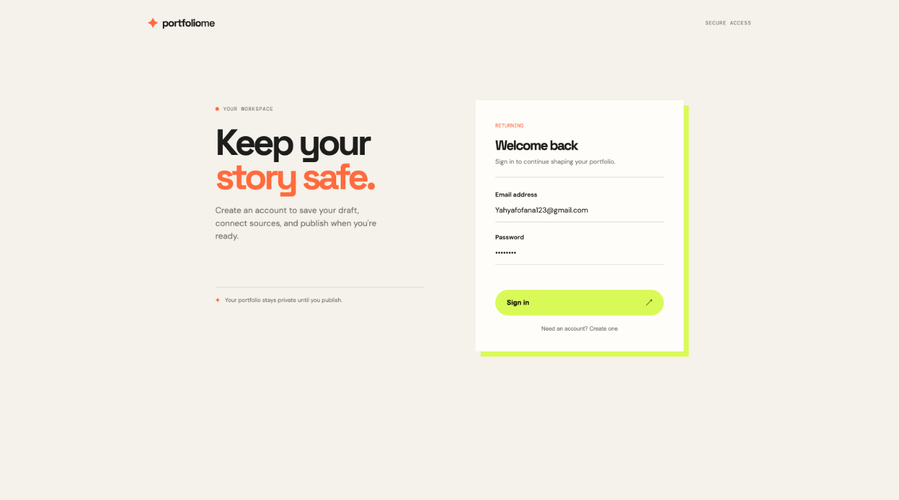
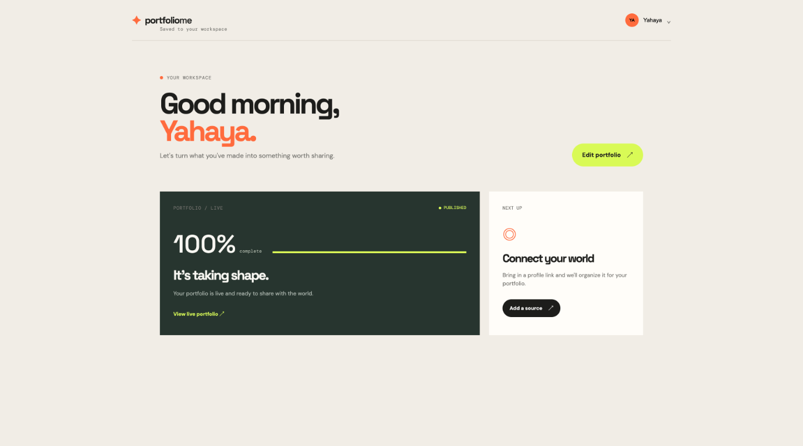
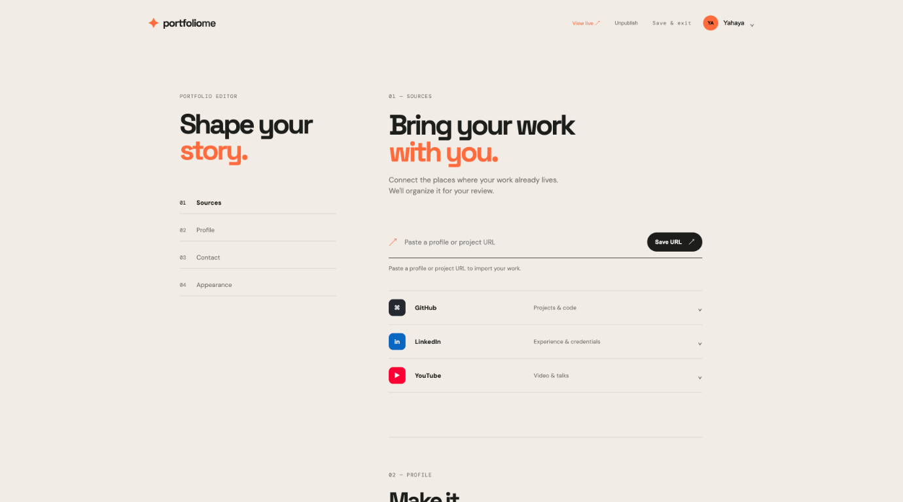
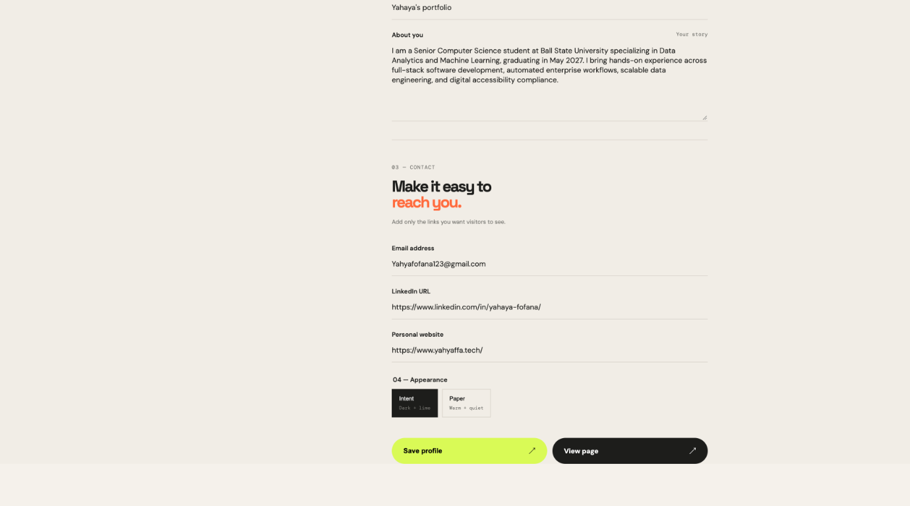
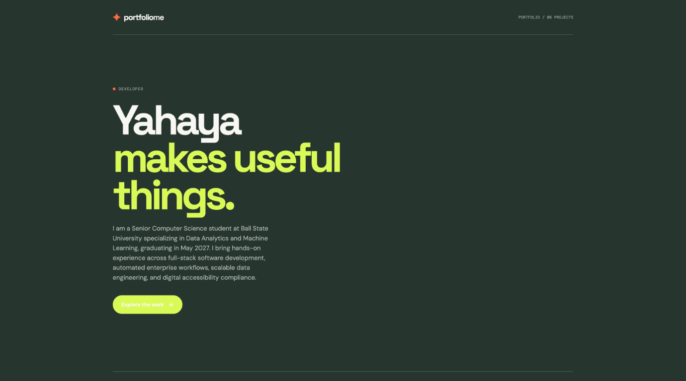

# Portfolio Me

Portfolio Me is a Next.js and TypeScript foundation for turning a creator's existing online work into a polished portfolio.

Visit the site at https://portfolio-me.yahyafofana00.workers.dev/

## Local development

```bash
npm install
npm run dev
```

The first product surface is the marketing page and interactive first-draft preview. Future work can add authentication, provider connections, background imports, and a persisted portfolio editor without changing the public page architecture.

## Supabase setup

1. Copy `.env.example` to `.env.local`.
2. Add the Supabase publishable `anon` key to `NEXT_PUBLIC_SUPABASE_ANON_KEY`.
3. For a new Supabase project, run [`supabase/schema.sql`](./supabase/schema.sql) in the SQL Editor.
4. For the existing project after the initial schema has already run, run [`002_projects_and_publishing.sql`](./supabase/migrations/002_projects_and_publishing.sql) instead.
5. Start the app with `npm run dev`.

Onboarding drafts are persisted to `profiles`, `portfolios`, and (when provided) `sources` after the user signs in. The local draft is retained until the database write succeeds.

### Cloudflare deployment

Cloudflare does not read your local `.env.local` file. In the Cloudflare Pages/Workers project settings, add these variables for the Production environment (and Preview if needed), then trigger a new deployment:

```text
NEXT_PUBLIC_SUPABASE_URL=https://qeziiaarrjbywtsmapqz.supabase.co
NEXT_PUBLIC_SUPABASE_ANON_KEY=your_supabase_publishable_anon_key
```

Use the Supabase publishable/anon key only. Never add the Supabase service-role key to client-visible or `NEXT_PUBLIC_` variables.

This project deploys to Cloudflare Workers through the OpenNext adapter. Install dependencies, set the anon key as a Cloudflare variable or secret, and deploy with:

```bash
npm install
npm run cf:deploy
```

For a Cloudflare dashboard build/deploy setup, use these exact commands:

```text
Build command: npm run cf:build
Deploy command: npx wrangler deploy
```

Do not use only `npx wrangler deploy` as the build command. It expects `.open-next/worker.js`, which is created by `npm run cf:build`.

Because this key starts with `NEXT_PUBLIC_`, it must be available during the OpenNext build so it can be included in the browser auth bundle. Add `NEXT_PUBLIC_SUPABASE_ANON_KEY` as a Cloudflare build/deployment variable, then redeploy. A runtime-only Wrangler secret is not sufficient for this client-side variable. The Supabase publishable/anon key is designed to be public; never use the service-role key.

## GitHub import

The editor accepts a public GitHub profile or repository URL. It previews public, non-forked repositories through `/api/github/preview`; users review the results before approved projects are written to the `projects` table. Private repositories and authenticated GitHub access will be added after the public import flow is validated.

## Publishing

After saving a profile and approving projects, use **Publish portfolio** in the editor. Published portfolios are available at `/p/[slug]`. The public route only reads portfolios with `status = 'published'`, visible projects, and profiles linked to a published portfolio. The migration file is safe to run more than once.

The editor also supports optional public contact details: email, LinkedIn, and personal website. Apply [`003_profile_contact_links.sql`](./supabase/migrations/003_profile_contact_links.sql) to an existing database before saving these fields.

You can also mark imported projects as featured. Apply [`004_featured_projects.sql`](./supabase/migrations/004_featured_projects.sql) to an existing database before using the feature. Featured projects appear first on the public portfolio.

## Screenshots

### Landing page



### Sign in



### Dashboard



### Portfolio editor — sources



### Portfolio editor — profile and contact



### Published portfolio


